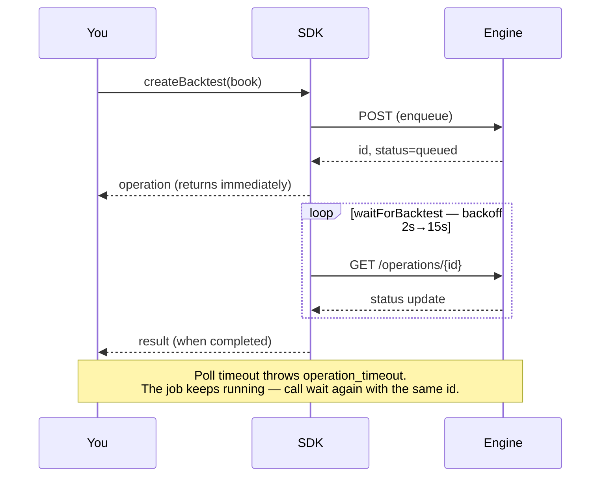
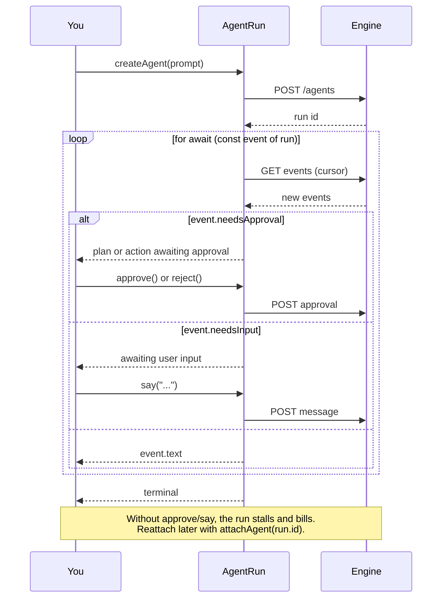
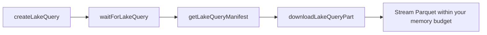

<div align="center">


# NexusTrade TypeScript SDK

**Author trading strategies in typed TypeScript. Backtest them on the engine that runs them live.**

[](https://www.npmjs.com/package/nexustrade)
[](https://www.npmjs.com/package/nexustrade)
[](LICENSE)
[](package.json)

[Quickstart](#quickstart) · [Authoring](#authoring-strategies) · [Polling](#jobs-run-on-the-engine--you-poll) · [Agents](#agent-runs) · [Lake SQL](#lake-sql) · [Auth](#authentication) · [Errors](#errors)

</div>

---

```bash
npm install nexustrade
```

**Zero runtime dependencies.** ESM and CommonJS builds ship together, with types.

## Quickstart

```ts
import {
  NexusTradeClient, always, backtest, buy, portfolio, stockAsset, strategy,
} from "nexustrade";

const nt = new NexusTradeClient({
  apiKey: "sk-...",
  baseUrl: "https://nexustrade.io/api/v1",
});

const book = portfolio("Example", [
  strategy("Buy SPY", always(), buy(stockAsset("SPY"), 100)),
]);

const operation = await nt.createBacktest(
  backtest(book, { startDate: "2024-01-01", endDate: "2024-12-31" }),
  { idempotencyKey: "example-v1" },
);
const result = await nt.waitForBacktest(operation.id as string);
console.log(result.result);
```

## Authoring strategies

Every builder is generated from the same indicator specification the NexusTrade
engine runs, so a book is **valid by construction** rather than by convention.

TypeScript cannot overload comparison operators, so indicators compose through
`gt` / `gte` / `lt` / `lte` / `eq` / `neq` and `and` / `or`:

```ts
import * as nt from "nexustrade";

const book = nt.portfolio("Momentum", [
  nt.strategy(
    "Rotate into strength",
    nt.always(),
    nt.dynamicRebalance({
      universe: nt.universe("SP500"),
      pipeline: [
        nt.filter(nt.gt(nt.Price(nt.CANDIDATE), nt.SMA(nt.CANDIDATE, 200))),
        nt.selectTop(nt.RSI(nt.CANDIDATE, 14), 10),
      ],
      weightIndicator: nt.RSI(nt.CANDIDATE, 14),
      limit: 10,
      deploymentPercent: 80,
    }),
  ),
], { initialValue: 100_000 });
```

<details>
<summary><b>What you can build</b> — 170+ generated builders</summary>

| Group | Examples |
| --- | --- |
| **Price & volume** | `Price` `OpeningPrice` `HighOfDay` `VWAP` `Volume` `GapPercentage` |
| **Technicals** | `SMA` `EMA` `RSI` `BollingerBand` `AverageTrueRange` `CrossAbove` |
| **Position state** | `PositionValue` `PositionPercentChange` `PositionMaxDrawdown` |
| **Portfolio state** | `PortfolioValue` `BuyingPower` `MaxDrawdown` `InitialValue` |
| **Fundamentals** | `Fundamental` `Economic` `DaysUntilEarnings` `IsIndexMember` `IsIndustry` |
| **Options** | `OptionDaysToExpiration` `OptionCollateral` `OptionUnrealizedPnL` `openOption` `closeOption` |
| **Actions** | `buy` `sell` `alert` `dynamicRebalance` `rebalanceOption` |
| **Selection** | `filter` `selectTop` `selectPercentile` `universe` |
| **Logic** | `always` `atLeast` `atMost` `exactly` `fewerThan` `multi` `and` `or` |

Every builder is fully typed — your editor completes the whole surface.

</details>

## Jobs run on the engine — you poll

`create*` enqueues work and returns immediately. It does **not** resolve when
results exist. There are no webhooks today.



Every job kind reports the same envelope, so one poller serves all of them:

```ts
{
  id: "op_...",
  kind: "backtest",          // backtest | optimization | walk_forward
  status: "queued",          // queued | running | completed | failed | cancelled
  result: {...},             // present only once terminal
  error: { code, message, retryable },
}
```

```ts
const finished = await nt.waitForBacktest(operation.id as string);
```

| Option | Default | Meaning |
| --- | --- | --- |
| `timeoutSeconds` | `900` | Give up waiting (the job keeps running) |
| `pollIntervalSeconds` | `2` | First interval; backs off 1.5× |
| `maxPollIntervalSeconds` | `15` | Interval ceiling |
| `throwOnFailure` | `true` | Throw on `failed`/`cancelled` instead of returning |

A timeout throws `operation_timeout` and does **not** cancel the job — call the
waiter again with the same id rather than resubmitting.

**Batches.** `createBacktests` submits many in one request and returns one
operation each; `waitForBacktests(operations)` waits on all of them. Prefer it
over a loop: one request, one idempotency key, one rate-limit slot.

**Optimization and walk-forward** follow the identical shape:

```ts
const study = await nt.createWalkForward(
  nt.walkForward(book, {
    globalStartDate: "2022-01-01",
    globalEndDate: "2024-12-31",
    foldCount: 4,
  }),
  { idempotencyKey: "wf-v1" },
);
await nt.waitForWalkForward(study.id as string);
```

## Agent runs

Every other job is fire-and-poll. **Agents are not** — three states
(`pending_plan_approval`, `pending_action_approval`, `awaiting_user_input`)
cannot advance without you. Iterate the run and answer when it blocks:



```ts
const run = await nt.createAgent("Find momentum names in the S&P 500", {
  idempotencyKey: "momentum-scan-v1",
});
for await (const event of run) {
  console.log(event.text);
  if (event.needsApproval) await run.approve();
  if (event.needsInput) await run.say("Focus on tech");
}
```

## Lake SQL

Read-only SQL over the NexusTrade market-data lake, against the server-resolved
`lake.*` catalog. Results are durable Parquet parts rather than an implicitly
materialized in-memory array.



```ts
const query = await nt.createLakeQuery(
  {
    query: "SELECT ticker, date, closingPrice FROM lake.daily_ohlc WHERE ticker = ?",
    params: ["AAPL"],
    limits: { maxRows: 10_000 },
  },
  { idempotencyKey: "aapl-daily-v1" },
);
const finished = await nt.waitForLakeQuery(query.id as string);
const manifest = await nt.getLakeQueryManifest(finished.id as string);
```

Use the manifest plus `downloadLakeQueryPart` to stream results within your own
memory budget. NexusTrade picks a compatible backing engine for the referenced
tables; your SQL does not change when it does.

> The Python SDK additionally ships `nt.lake.sql(...)`, a DuckDB/pandas
> convenience layer over these same endpoints.

## Authentication

Create a key at **[nexustrade.io/developers](https://nexustrade.io/developers)**
(Profile → API Keys). Keys start with `sk-` and are shown once.

```ts
const nt = new NexusTradeClient({
  apiKey: "sk-...",
  baseUrl: "https://nexustrade.io/api/v1",
});
// or set NEXUSTRADE_API_KEY / NEXUSTRADE_API_BASE_URL and:
const fromEnv = new NexusTradeClient();
```

Both variables are also read from a **`.env` file** at or above the current
directory, so a local project works with no exports, no `dotenv` dependency, and
no `--env-file` flag:

```bash
# .env
NEXUSTRADE_API_KEY=sk-...
NEXUSTRADE_API_BASE_URL=https://nexustrade.io/api/v1
```

The real environment always wins — a `.env` value is used only when the variable
is absent, so a stale file can never override what you exported. Nothing is
written back to `process.env`. Opt out with `NEXUSTRADE_DISABLE_DOTENV=1`.

| Scope | Grants |
| --- | --- |
| `read` | `getBacktest`, `getOptimization`, `getWalkForward` |
| `write` | `createPortfolio`, `createBacktest(s)`, `createOptimization`, `createWalkForward` |
| `lake` | Lake catalog, query lifecycle, manifests, result parts |

A key missing the scope gets `403 insufficient_scope`.

> **OAuth is not accepted here.** NexusTrade's OAuth flow serves the MCP server.
> These endpoints take `sk-` API keys only; a bearer JWT is rejected with
> `401 invalid_token`.

**Transport hardening.** HTTPS is required (except loopback). The client refuses
cross-origin redirects, so the credential cannot be replayed to another host, and
refuses to follow a redirect on any non-GET request, so a redirect can never
re-submit a paid job. The key is held in a `#private` field and never appears in
a stringified client.

## Idempotency

Every mutation takes a key. Reusing the same key with the same request returns
the original resource instead of launching a second paid job — so a retry after
a network failure is free.

```ts
await nt.createBacktest(handle, { idempotencyKey: "momentum-2024-v1" });
```

## Errors

```ts
import { NexusTradeApiError } from "nexustrade";

try {
  await nt.createBacktest(handle, { idempotencyKey: "run-1" });
} catch (error) {
  if (error instanceof NexusTradeApiError && error.code === "rate_limit_exceeded") {
    // back off
  }
  throw error;
}
```

| Status | Code | Meaning |
| --- | --- | --- |
| 401 | `invalid_token` | Missing, malformed, or expired key (or an OAuth JWT) |
| 403 | `insufficient_scope` | Key lacks `read`, `write`, or `lake` |
| 400 | `invalid_request`, `invalid_portfolio` | Malformed input |
| 400 | `invalid_idempotency_key` | Must match `[A-Za-z0-9._:-]{1,160}` |
| 409 | `idempotency_conflict` | Key reused with a different payload |
| 409 | `idempotency_in_progress` | Same key, first call still running. Re-poll, do not resubmit |
| 404 | `not_found`, `operation_not_found` | Unknown or not yours |
| 429 | `rate_limit_exceeded` | Back off and retry |

`status` is `0` when no HTTP status describes the failure: `transport_error`
(never reached the API), `unsafe_redirect`, or an `invalid_response` envelope
check on an otherwise-successful reply.

## Timeouts

`new HttpTransport({ timeoutSeconds })` (default 30) is a total wall-clock
deadline for one request. Neither it nor the poll timeout bounds how long a
*job* takes.

## Scope

Portfolio drafting, backtesting, optimization, walk-forward studies, and
read-only SQL over the market-data lake, versioned under `/api/v1/nexustrade`.
The screener and live trading remain outside this surface.

## Requirements

Node 18+ (uses the global `fetch`). Contributing: the test suite runs TypeScript
directly via `node --test`, which needs Node 22.6+ for type stripping. The
published `dist/` is plain JavaScript and has no such requirement.

## Using this SDK with a coding agent

See **[AGENTS.md](AGENTS.md)** — the conventions, invariants, and recipes an
agent needs to write correct NexusTrade strategies on the first pass.

## License

MIT
