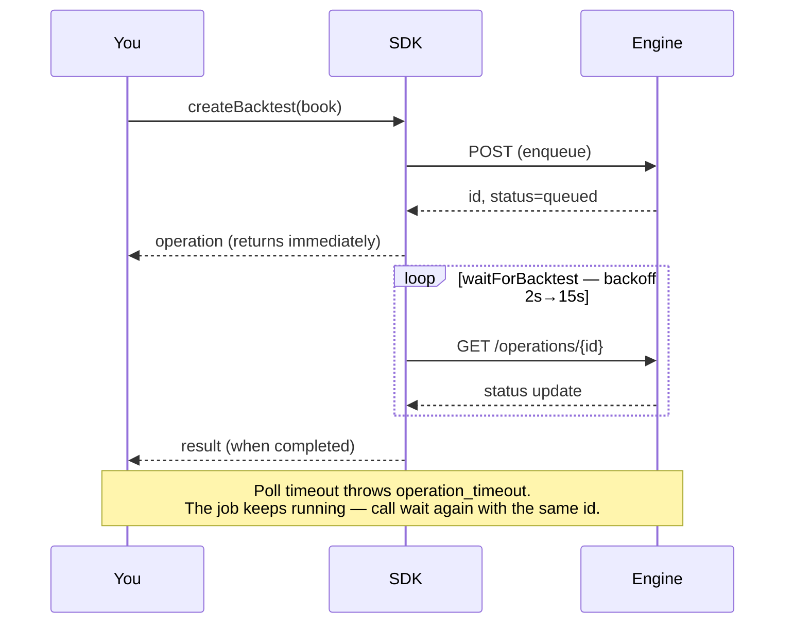
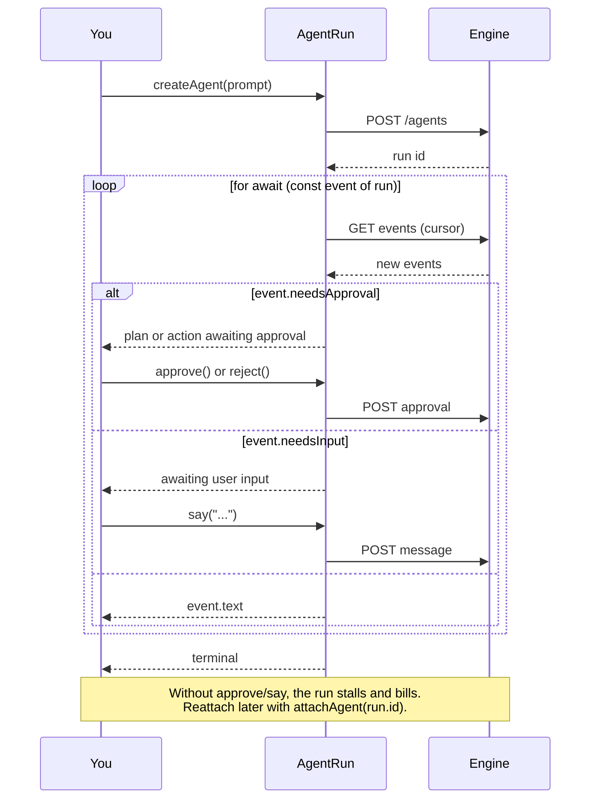
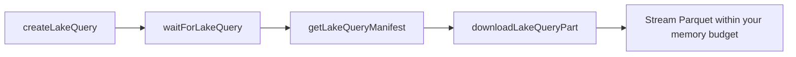

<div align="center">


# NexusTrade TypeScript SDK

**Author trading strategies in typed TypeScript. Backtest them on the engine that runs them live.**

[](https://www.npmjs.com/package/nexustrade)
[](https://www.npmjs.com/package/nexustrade)
[](LICENSE)
[](package.json)

[Quickstart](#quickstart) · [Authoring](#authoring-strategies) · [Polling](#jobs-run-on-the-engine--you-poll) · [Agents](#agent-runs) · [Lake SQL](#lake-sql) · [Auth](#authentication) · [Errors](#errors)

</div>

---

```bash
npm install nexustrade
```

**Zero runtime dependencies.** ESM and CommonJS builds ship together, with types.

## Quickstart

```ts
import {
  NexusTradeClient,
  always,
  backtest,
  buy,
  portfolio,
  stockAsset,
  strategy,
} from "nexustrade";

const client = new NexusTradeClient({
  apiKey: "sk-...",
  baseUrl: "https://nexustrade.io/api/v1",
});

const book = portfolio("Example", [
  strategy("Buy SPY", always(), buy(stockAsset("SPY"), 100)),
]);

const operation = await client.createBacktest(
  backtest(book, { startDate: "2024-01-01", endDate: "2024-12-31" }),
  { idempotencyKey: "example-v1" }
);
const result = await client.waitForBacktest(operation.id as string);
console.log(result.result);
```

Backtest operations may include `warnings: string[]` immediately after
submission and again in the terminal `result`. Treat them as material caveats;
they do not change a successful operation into a failure.

## Authoring strategies

Every builder is generated from the same indicator specification the NexusTrade
engine runs, so a book is **valid by construction** rather than by convention.

TypeScript cannot overload comparison operators, so indicators compose through
`gt` / `gte` / `lt` / `lte` / `eq` / `neq` and `and` / `or`:

```ts
import * as nt from "nexustrade";

const book = nt.portfolio(
  "Momentum",
  [
    nt.strategy(
      "Rotate into strength",
      nt.always(),
      nt.dynamicRebalance({
        universe: nt.universe("SP500"),
        pipeline: [
          nt.filter(nt.gt(nt.Price(nt.CANDIDATE), nt.SMA(nt.CANDIDATE, 200))),
          nt.selectTop(nt.RSI(nt.CANDIDATE, 14), 10),
        ],
        weightIndicator: nt.RSI(nt.CANDIDATE, 14),
        limit: 10,
        deploymentPercent: 80,
      })
    ),
  ],
  { initialValue: 100_000 }
);
```

<details>
<summary><b>What you can build</b> — 170+ generated builders</summary>

| Group               | Examples                                                                                     |
| ------------------- | -------------------------------------------------------------------------------------------- |
| **Price & volume**  | `Price` `OpeningPrice` `HighOfDay` `VWAP` `Volume` `GapPercentage`                           |
| **Technicals**      | `SMA` `EMA` `RSI` `BollingerBand` `AverageTrueRange` `CrossAbove`                            |
| **Position state**  | `PositionValue` `PositionPercentChange` `PositionMaxDrawdown`                                |
| **Portfolio state** | `PortfolioValue` `BuyingPower` `MaxDrawdown` `InitialValue`                                  |
| **Fundamentals**    | `Fundamental` `Economic` `DaysUntilEarnings` `IsIndexMember` `IsIndustry`                    |
| **Options**         | `OptionDaysToExpiration` `OptionCollateral` `OptionUnrealizedPnL` `openOption` `closeOption` |
| **Actions**         | `buy` `sell` `alert` `dynamicRebalance` `rebalanceOption`                                    |
| **Selection**       | `filter` `selectTop` `selectPercentile` `universe`                                           |
| **Logic**           | `always` `atLeast` `atMost` `exactly` `fewerThan` `multi` `and` `or`                         |

Every builder is fully typed — your editor completes the whole surface.

</details>

## Jobs run on the engine — you poll

`create*` enqueues work and returns immediately. It does **not** resolve when
results exist. There are no webhooks today.



Every job kind reports the same envelope, so one poller serves all of them:

```ts
{
  id: "op_...",
  kind: "backtest",          // backtest | optimization | walk_forward
  status: "queued",          // queued | running | completed | failed | cancelled
  result: {...},             // present only once terminal
  error: { code, message, retryable },
}
```

```ts
const finished = await client.waitForBacktest(operation.id as string);
```

| Option                   | Default | Meaning                                            |
| ------------------------ | ------- | -------------------------------------------------- |
| `timeoutSeconds`         | `900`   | Give up waiting (the job keeps running)            |
| `pollIntervalSeconds`    | `2`     | First interval; backs off 1.5×                     |
| `maxPollIntervalSeconds` | `15`    | Interval ceiling                                   |
| `throwOnFailure`         | `true`  | Throw on `failed`/`cancelled` instead of returning |

A timeout throws `operation_timeout` and does **not** cancel the job — call the
waiter again with the same id rather than resubmitting.

**Batches.** `createBacktests` submits many in one request and returns one
operation each; `waitForBacktests(operations)` waits on all of them. Prefer it
over a loop: one request, one idempotency key, one rate-limit slot.

**Optimization and walk-forward** follow the identical shape:

```ts
const study = await client.createWalkForward(
  nt.walkForward(book, {
    globalStartDate: "2022-01-01",
    globalEndDate: "2024-12-31",
    foldCount: 4,
  }),
  { idempotencyKey: "wf-v1" }
);
await client.waitForWalkForward(study.id as string);
```

## Deploying a portfolio

Authoring and backtesting a book does not persist it. `save` writes it to your
account; `deploy` starts running it.

```ts
const book = nt.portfolio("Momentum", [
  /* … */
]);

await book.save({ idempotencyKey: "momentum-v1" }); // persists; sets book.id
const deployment = await book.deploy(); // starts paper trading
await book.undeploy(); // stops it
```

**`save` and `deploy` produce different ids, and the distinction matters.**
`save` persists a _draft_ and sets `book.id` to it. `deploy` mints the real
paper portfolio and returns its own `portfolioId` — deploying creates a
portfolio rather than converting the draft into one, so the two ids coexist.
Hold on to `deployment.portfolioId` for anything that reads live state;
`book.id` addresses the draft.

```ts
deployment.portfolioId; // the running portfolio
deployment.deploymentType; // paper, unless you deployed an existing live one
deployment.outcome; // created | reactivated
```

Handle methods accept an optional `transport`; omitted, they resolve one from
the environment. The same operations exist on the client — `client.deploy(id)`,
`client.undeploy(id)` — when you have an id rather than a handle.

```ts
await client.listPortfolios({ includePaper: true, includePositions: true });
await client.getPortfolio(portfolioId);
```

`listPortfolios` filters with `includePaper`, `includeLive`, `includeInactive`,
`includeChatPortfolios`, `search`, `limit`, and `page`. `includePositions`
defaults off when `search` is set.

**A portfolio you create here is always paper**, and minting a _live_ one still
happens in the web app. Orders and brokerage status are reachable from here;
see [Live trading](#live-trading).

**But `deploy` can start live trading.** Given the id of a portfolio that is
already deployed, it reactivates that portfolio as whatever it already is — so
`client.deploy(id)` on a paused live portfolio resumes live trading against the connected
brokerage, and `includeLive: true` above will hand you such an id. Check `deployment.deploymentType` before
treating a deploy as simulated.

## Live trading

Live trading needs a brokerage linked to your account. Linking is an OAuth
redirect, so an API key cannot complete it — a human opens the URL.

```ts
await client.listBrokerages();
// [{ brokerage: "Alpaca", connected: false,
//    connectUrl: "https://nexustrade.io/live-trading" }, ...]

await client.connectBrokerage("Alpaca"); // logs the URL, waits until connected
```

`connectBrokerage` waits by default **only when stdout is a TTY**. In CI, cron,
or `run_compute` it rejects with `brokerage_not_connected` immediately, with the
URL in the message, rather than stalling for five minutes in front of nobody.
Pass `{ wait: true }` or `{ wait: false }` to force either.

A live-only listing that comes back empty rejects with the same error rather
than an empty array, since an empty array says nothing about why:

```ts
await client.listPortfolios({ includeLive: true, includePaper: false });
// NexusTradeApiError: brokerage_not_connected: No live portfolios, and no
// brokerage is connected. Connect one at https://nexustrade.io/live-trading
```

### Orders

```ts
const result = await client.createOrders(
  portfolioId,
  [
    {
      asset: { name: "SPY", type: "STOCK", symbol: "SPY" },
      side: "BUY",
      quantity: 10,
      orderType: "MARKET",
    },
  ],
  { idempotencyKey: "rebalance-2024-04-01" }
);

// Dollar notional (stock/crypto only — options require contract quantity):
await client.createOrders(
  portfolioId,
  [
    {
      asset: { name: "AAPL", type: "STOCK", symbol: "AAPL" },
      side: "BUY",
      amount: 500,
      orderType: "MARKET",
    },
  ],
  { idempotencyKey: "buy-aapl-500" }
);
```

**Paper orders are accepted immediately. Live orders are staged for approval
and are never sent to a broker by this call.**

```ts
if (result.requiresApproval) {
  console.log("nothing has traded yet — approve at", result.approvalUrl);
}
```

There is no argument, scope, or flag that submits a live order without
approval. The brokerage boundary refuses an unapproved live order regardless of
what any caller asks for, so this is a property of the system rather than a
promise made by this method. At most 50 orders per request.

## Your own data

A custom data source is a time series you own — sentiment counts, a proprietary
factor, anything the platform does not already carry. Create one, then reference
it from a strategy with `CustomIndicator`.

```ts
const series = await client.createCustomIndicator(
  {
    name: "WSB NVDA Mentions",
    scope: "asset",
    description: "Daily r/wallstreetbets mentions",
    pointKind: "observation",
    points: [
      { timestamp: "2024-04-01", value: 152, ticker: "NVDA" },
      { timestamp: "2024-04-02", value: 90, ticker: "NVDA" },
    ],
  },
  { idempotencyKey: "wsb-mentions-v1" }
);

const busy = nt.gt(
  nt.CustomIndicator(nt.stockAsset("NVDA"), String(series.customIndicatorId)),
  100
);
const book = nt.portfolio("Attention", [
  nt.strategy("Buy the buzz", busy, nt.buy(nt.stockAsset("NVDA"), 25)),
]);
```

`scope` is `"global"` (one series) or `"asset"` (one series per ticker, so every
point needs a `ticker`). It cannot be changed after creation.

Declare `pointKind` whenever the time semantics are known: `observation` for
point-in-time samples, `period_aggregate` plus `aggregatePeriod` (`1d`, `1w`,
`1mo`, or `1q`) for closed-period values, and `disclosed` for values with an
explicit publication time on every row. The SDK applies this contract before
both inline and large-upload writes. A same-day date-only observation becomes
an explicit same-day UTC instant instead of shifting to the next calendar day.

**Size is not a constraint.** `points` is unlimited. A batch that fits the
request goes with it; a larger one is uploaded to storage and validated before
the call resolves. Either way the returned indicator reflects what actually
landed, and an upload that fails validation rejects rather than reporting
success.

**Growing a series.** Append to the same id every run:

```ts
await client.appendCustomIndicatorPoints(
  String(series.customIndicatorId),
  [{ timestamp: "2024-04-03", value: 118, ticker: "NVDA" }],
  { idempotencyKey: "wsb-mentions-2024-04-03" }
);
```

Creating a fresh series per run splits the history into fragments no strategy
can read. Re-sending an identical batch is safe — the duplicate is not written
twice.

| Call                                                          | Purpose                   |
| ------------------------------------------------------------- | ------------------------- |
| `createCustomIndicator(spec, { idempotencyKey })`             | Create, optionally seeded |
| `appendCustomIndicatorPoints(id, points, { idempotencyKey })` | Add points                |
| `replaceCustomIndicatorPoints(id, points, { idempotencyKey })` | Replace points, retain id |
| `archiveCustomIndicator(id)` / `restoreCustomIndicator(id)`   | Reversible lifecycle      |
| `listCustomIndicators()` / `getCustomIndicator(id)`           | Discover ids and coverage |

Points accept `timestamp`, `value`, `ticker`, `assetType`, and `availableAt`
— camelCase or snake_case, with `Date` objects allowed. Set `availableAt` when a
value became knowable later than it is dated: an earnings figure stamped to
quarter-end but published weeks after. An unrecognized field throws rather than
being silently dropped.

To hand over a file you already have on disk, `createCustomIndicatorUpload` /
`completeCustomIndicatorUpload` / `waitForCustomIndicatorUpload` expose the
three steps directly. CSV, JSON, and JSONL up to 100 MB.

## Agent runs

Every other job is fire-and-poll. **Agents are not** — three states
(`pending_plan_approval`, `pending_action_approval`, `awaiting_user_input`)
cannot advance without you. Iterate the run and answer when it blocks:



```ts
const run = await client.createAgent("Find momentum names in the S&P 500", {
  idempotencyKey: "momentum-scan-v1",
});
for await (const event of run) {
  console.log(event.text);
  if (event.needsApproval) await run.approve();
  if (event.needsInput) await run.say("Focus on tech");
}
```

## Lake SQL

Read-only SQL over the NexusTrade market-data lake, against the server-resolved
`lake.*` catalog. Results are durable Parquet parts rather than an implicitly
materialized in-memory array.



```ts
const query = await client.createLakeQuery(
  {
    query:
      "SELECT ticker, date, closingPrice FROM lake.daily_ohlc WHERE ticker = ?",
    params: ["AAPL"],
    limits: { maxRows: 10_000 },
  },
  { idempotencyKey: "aapl-daily-v1" }
);
const finished = await client.waitForLakeQuery(query.id as string);
const manifest = await client.getLakeQueryManifest(finished.id as string);
```

## Natural language

Describe the screen instead of writing the SQL. The server generates it,
validates it against the same `lake.*` catalog the engine reads, executes it,
and hands back both the rows and the statement.

```ts
const screen = await client.createNlScreen(
  "technology stocks with a market cap over 100 billion and a PE under 30"
);
const done = await client.waitForNlScreen(screen.id as string);

const result = done.result as Record<string, unknown>;
console.log(result.rows);
console.log(result.sql); // always check the SQL — it is model-generated
```

`returnQuery` defaults to `true` because the SQL is the audit trail: without it
the rows are a number you cannot re-derive. It is returned on failure whatever
you pass, since a rejected query is the most useful thing to read.

Branch on `result.outcome`, not on status alone:

| `outcome`           | Meaning                                                   |
| ------------------- | --------------------------------------------------------- |
| `ROWS`              | Matches found                                              |
| `EMPTY`             | Every filter ran and nothing cleared them all — an answer  |
| `CLARIFICATION`     | The question was ambiguous; `result.clarification` asks    |
| `GENERATION_FAILED` | The retry budget was spent — the only case worth retrying  |

This method spends LLM credits. The structured `lake` API below does not.

Use the manifest plus `downloadLakeQueryPart` to stream results within your own
memory budget. NexusTrade picks a compatible backing engine for the referenced
tables; your SQL does not change when it does.

> The Python SDK additionally ships `nt.lake.sql(...)`, a DuckDB/pandas
> convenience layer over these same endpoints.

## Complete method reference

Every public method on `NexusTradeClient`. A test in this package fails if one
is missing here, so this list cannot drift from the code.

**Live trading and orders**

| Method                                                  | Purpose                                              |
| ------------------------------------------------------- | ---------------------------------------------------- |
| `listBrokerages()`                                      | Every connectable brokerage and whether it is linked |
| `getBrokerage(brokerage)`                               | Whether one brokerage is linked                      |
| `connectBrokerage(brokerage, { wait })`                 | Log the connect URL and wait for the link            |
| `createOrders(portfolioId, orders, { idempotencyKey })` | Stage orders; live ones need approval                |

**Portfolios**

| Method                                      | Purpose                                      |
| ------------------------------------------- | -------------------------------------------- |
| `createPortfolio(book, { idempotencyKey })` | Persist a portfolio definition               |
| `listPortfolios(options)`                   | List portfolios, with filters and pagination |
| `getPortfolio(portfolioId)`                 | Read one portfolio                           |
| `deploy(portfolioId, { frequency })`        | Start paper trading it                       |
| `undeploy(portfolioId)`                     | Stop it                                      |

**Backtests**

| Method                                         | Purpose                    |
| ---------------------------------------------- | -------------------------- |
| `createBacktest(handle, { idempotencyKey })`   | Submit one backtest        |
| `createBacktests(handles, { idempotencyKey })` | Submit many in one request |
| `getBacktest(backtestId)`                      | Read the operation         |
| `waitForBacktest(backtestId, options)`         | Block until terminal       |
| `waitForBacktests(operations, options)`        | Block on a whole batch     |

**Optimization and walk-forward**

| Method                                           | Purpose                     |
| ------------------------------------------------ | --------------------------- |
| `createOptimization(handle, { idempotencyKey })` | Submit an optimization      |
| `getOptimization(optimizationId)`                | Read the operation          |
| `waitForOptimization(optimizationId, options)`   | Block until terminal        |
| `createWalkForward(handle, { idempotencyKey })`  | Submit a walk-forward study |
| `getWalkForward(studyId)`                        | Read the operation          |
| `waitForWalkForward(studyId, options)`           | Block until terminal        |

**Custom data sources**

| Method                                                                      | Purpose                                            |
| --------------------------------------------------------------------------- | -------------------------------------------------- |
| `createCustomIndicator(spec, { idempotencyKey })`                           | Create a series, optionally seeded                 |
| `listCustomIndicators(options)`                                             | List owned series                                  |
| `getCustomIndicator(id)`                                                    | Read one, with its point count and range           |
| `appendCustomIndicatorPoints(id, points, { idempotencyKey })`               | Add points                                         |
| `replaceCustomIndicatorPoints(id, points, { idempotencyKey, allowShrink })` | Replace the complete series while retaining its id |
| `archiveCustomIndicator(id, { confirm })`                                   | Soft-archive a series                              |
| `restoreCustomIndicator(id)`                                                | Restore an archived series                         |
| `createCustomIndicatorUpload(id, options)`                                  | Open an upload slot (CSV/JSON/JSONL)               |
| `completeCustomIndicatorUpload(id, jobId)`                                  | Start validating uploaded bytes                    |
| `getCustomIndicatorUpload(id, jobId)`                                       | Read the upload operation                          |
| `waitForCustomIndicatorUpload(id, jobId, options)`                          | Block until validated                              |

**Agent runs**

| Method                                    | Purpose                             |
| ----------------------------------------- | ----------------------------------- |
| `createAgent(prompt, { idempotencyKey })` | Start a run                         |
| `getAgent(agentId)`                       | Read its status                     |
| `attachAgent(agentId, { cursor })`        | Reattach to a run already in flight |

**Lake SQL**

| Method                                          | Purpose                              |
| ----------------------------------------------- | ------------------------------------ |
| `createLakeQuery(request, { idempotencyKey })`  | Submit read-only SQL                 |
| `getLakeQuery(queryId)`                         | Read the operation                   |
| `waitForLakeQuery(queryId, options)`            | Block until terminal                 |
| `cancelLakeQuery(queryId)`                      | Cancel an owned query                |
| `getLakeQueryManifest(queryId)`                 | Schema, checksums, and part metadata |
| `downloadLakeQueryPart(queryId, part, options)` | Download one Parquet part            |
| `getLakeCatalog()`                              | List queryable tables                |
| `describeLakeTable(table)`                      | Columns and types for one table      |

**Natural language**

| Method                                      | Purpose                                     |
| ------------------------------------------- | ------------------------------------------- |
| `createNlScreen(question, { returnQuery })` | Screen stocks from a plain-language question |
| `getNlScreen(screenId)`                     | Read the operation                          |
| `waitForNlScreen(screenId, options)`        | Block until terminal                        |
| `cancelNlScreen(screenId)`                  | Cancel an owned screen                      |

**Client construction**

| Method                                      | Purpose                                  |
| ------------------------------------------- | ---------------------------------------- |
| `new NexusTradeClient({ apiKey, baseUrl })` | Explicit credentials                     |
| `NexusTradeClient.fromEnvironment()`        | Read them from the environment or `.env` |

**PortfolioHandle** — returned by the `portfolio(...)` builder and by
`getPortfolio` / `listPortfolios`.

| Method                                             | Purpose                                |
| -------------------------------------------------- | -------------------------------------- |
| `save({ idempotencyKey })`                         | Persist it as a draft, setting `.id`   |
| `backtest({ startDate, endDate, idempotencyKey })` | Backtest it, preferring the saved id   |
| `deploy({ frequency })`                            | Mint the real paper portfolio (new id) |
| `undeploy()`                                       | Deactivate its deployment              |

## Authentication

Create a key at **[nexustrade.io/developers](https://nexustrade.io/developers)**
(Profile → API Keys). Keys start with `sk-` and are shown once.

```ts
const client = new NexusTradeClient({
  apiKey: "sk-...",
  baseUrl: "https://nexustrade.io/api/v1",
});
// or set NEXUSTRADE_API_KEY / NEXUSTRADE_API_BASE_URL and:
const fromEnv = new NexusTradeClient();
```

Both variables are also read from a **`.env` file** at or above the current
directory, so a local project works with no exports, no `dotenv` dependency, and
no `--env-file` flag:

```bash
# .env
NEXUSTRADE_API_KEY=sk-...
NEXUSTRADE_API_BASE_URL=https://nexustrade.io/api/v1
```

The real environment always wins — a `.env` value is used only when the variable
is absent, so a stale file can never override what you exported. Nothing is
written back to `process.env`. Opt out with `NEXUSTRADE_DISABLE_DOTENV=1`.

| Scope   | Grants                                                                            |
| ------- | --------------------------------------------------------------------------------- |
| `read`  | `getBacktest`, `getOptimization`, `getWalkForward`                                |
| `write` | `createPortfolio`, `createBacktest(s)`, `createOptimization`, `createWalkForward` |
| `lake`  | Lake catalog, query lifecycle, manifests, result parts                            |

A key missing the scope gets `403 insufficient_scope`.

> **OAuth is not accepted here.** NexusTrade's OAuth flow serves the MCP server.
> These endpoints take `sk-` API keys only; a bearer JWT is rejected with
> `401 invalid_token`.

**Transport hardening.** HTTPS is required (except loopback). The client refuses
cross-origin redirects, so the credential cannot be replayed to another host, and
refuses to follow a redirect on any non-GET request, so a redirect can never
re-submit a paid job. The key is held in a `#private` field and never appears in
a stringified client.

## Idempotency

Every mutation takes a key. Reusing the same key with the same request returns
the original resource instead of launching a second paid job — so a retry after
a network failure is free.

```ts
await client.createBacktest(handle, { idempotencyKey: "momentum-2024-v1" });
```

## Errors

```ts
import { NexusTradeApiError } from "nexustrade";

try {
  await client.createBacktest(handle, { idempotencyKey: "run-1" });
} catch (error) {
  if (
    error instanceof NexusTradeApiError &&
    error.code === "rate_limit_exceeded"
  ) {
    // back off
  }
  throw error;
}
```

| Status | Code                                   | Meaning                                                      |
| ------ | -------------------------------------- | ------------------------------------------------------------ |
| 401    | `invalid_token`                        | Missing, malformed, or expired key (or an OAuth JWT)         |
| 403    | `insufficient_scope`                   | Key lacks `read`, `write`, or `lake`                         |
| 400    | `invalid_request`, `invalid_portfolio` | Malformed input                                              |
| 400    | `invalid_idempotency_key`              | Must match `[A-Za-z0-9._:-]{1,160}`                          |
| 409    | `idempotency_conflict`                 | Key reused with a different payload                          |
| 409    | `idempotency_in_progress`              | Same key, first call still running. Re-poll, do not resubmit |
| 404    | `not_found`, `operation_not_found`     | Unknown or not yours                                         |
| 429    | `rate_limit_exceeded`                  | Back off and retry                                           |

`status` is `0` when no HTTP status describes the failure: `transport_error`
(never reached the API), `unsafe_redirect`, or an `invalid_response` envelope
check on an otherwise-successful reply.

## Timeouts

`new HttpTransport({ timeoutSeconds })` (default 30) is a total wall-clock
deadline for one request. Neither it nor the poll timeout bounds how long a
_job_ takes.

## Scope

Portfolio drafting, backtesting, optimization, walk-forward studies, and
read-only SQL over the market-data lake, versioned under `/api/v1/nexustrade`.
The screener and creating a live deployment remain outside this surface.
Orders are reachable, but a live order is only ever staged for human approval —
never submitted. `deploy` and `undeploy` act on whatever an existing id already
is, live included.

## Requirements

Node 18+ (uses the global `fetch`). Contributing: the test suite runs TypeScript
directly via `node --test`, which needs Node 22.6+ for type stripping. The
published `dist/` is plain JavaScript and has no such requirement.

## Using this SDK with a coding agent

See **[AGENTS.md](AGENTS.md)** — the conventions, invariants, and recipes an
agent needs to write correct NexusTrade strategies on the first pass.

## License

MIT
